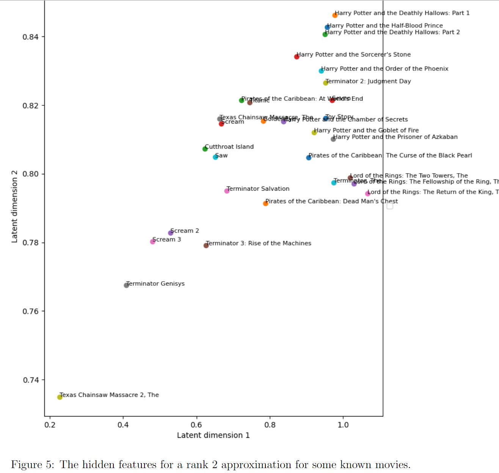

# Matrix factorization and collaborative filtering for movie recommendations

## Introduction
In this project, the assignment was to implement three different matrix factorization algorithms with Numpy, based on the Small movie lens dataset (https://www.kaggle.com/datasets/shubhammehta21/movie-lens-small-latest-dataset), and see how they perform on the task of predicting movie ratings. The algorithms implemented were:
- Singular Value Decomposition (SVD)
- Alternating Least Squares (ALS)
- Gradient Descent (GD)

## Data
The data consists of 100,836 ratings of 9,742 movies by 610 users. The data was read to a numpy matrix, where the rows correspond to users and the columns to movies. The matrix was very sparse with sparsity rate of 

## Projections of some famous movies

*This Figure shows the position of movies, when movies are projected to two dimensions. It can be seen, that similar movies are at similar locations. What each latent dimension tells, is not clear.*

